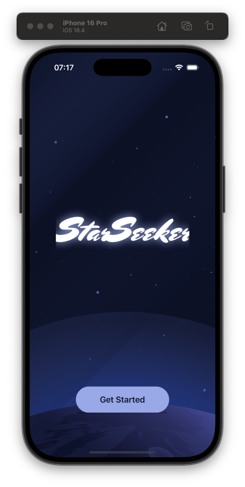
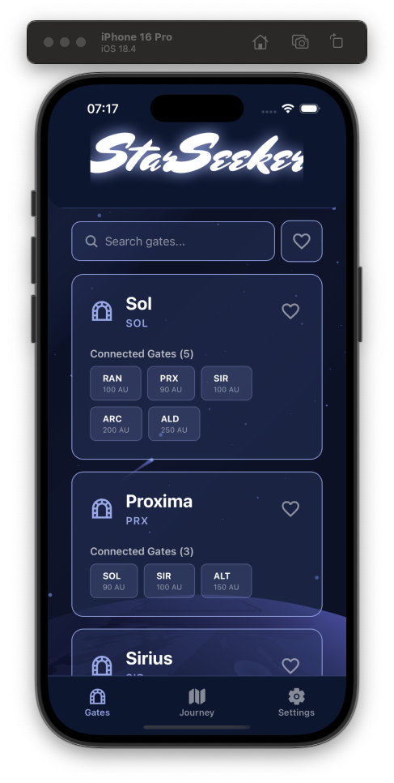
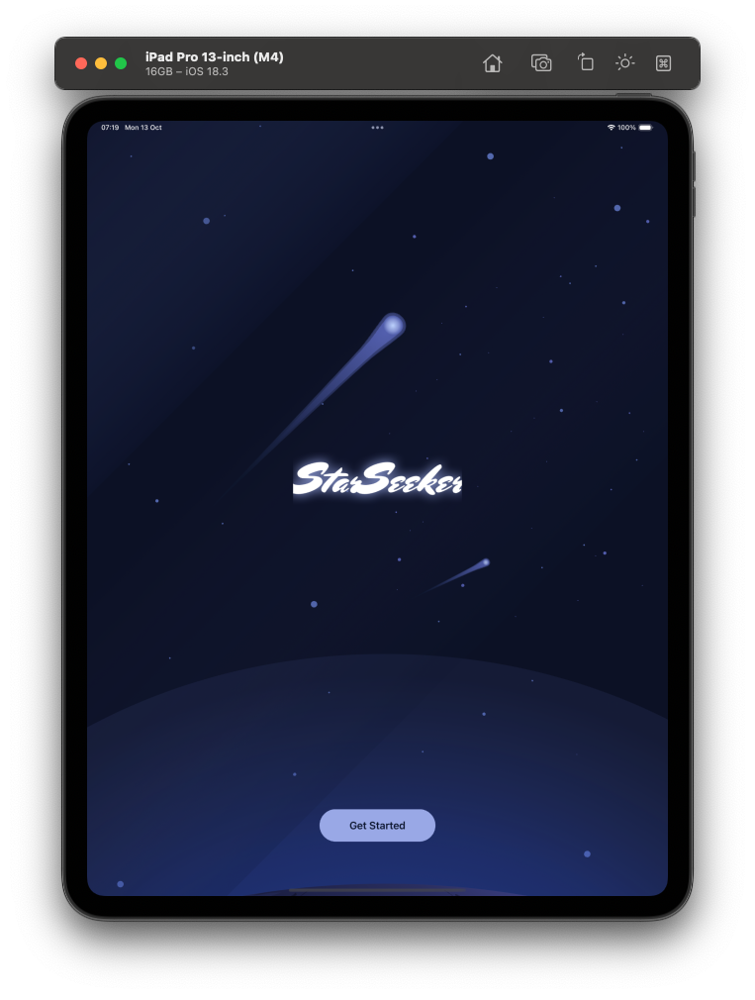
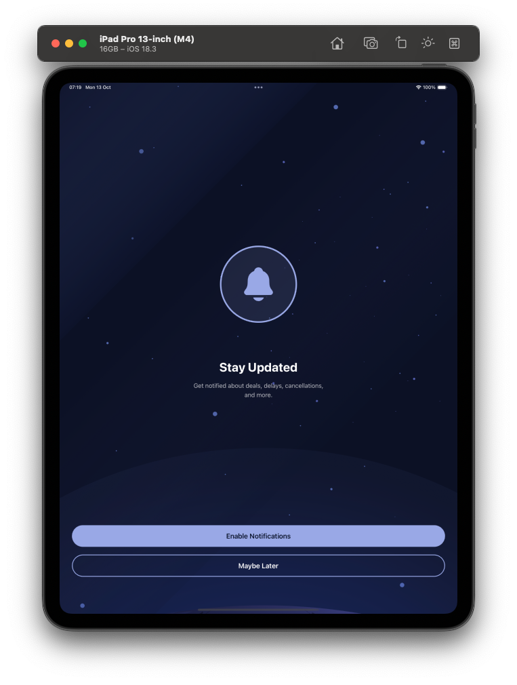
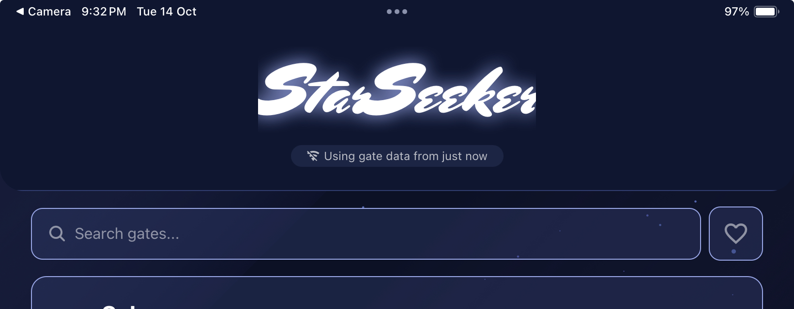

# StarSeeker ✨

A mobile app for tracking and managing gate information, built with Expo and React Native.

## Quick Start - Try it Now!

Scan the QR code below with the Expo Go app to try StarSeeker instantly:

<div align="center">
  
</div>

### Installation Steps

1. **Install Expo Go** on your device:

   - [iOS App Store](https://apps.apple.com/app/expo-go/id982107779)
   - [Android Play Store](https://play.google.com/store/apps/details?id=host.exp.exponent)

2. **Scan the QR code** above with:

   - iOS: Use your Camera app
   - Android: Use the Expo Go app's built-in scanner

3. **Start exploring!** The app will load automatically.

## Screenshots

<div align="center">
  
  
  
</div>

<div align="center">
  
  
</div>

## Development Setup

### Prerequisites

- Node.js (v18 or newer)
- npm or yarn
- Expo Go app (for testing)

### Local Development

1. **Clone and install dependencies**

   ```bash
   git clone https://github.com/leightontipene95/StarSeeker.git
   cd StarSeeker
   npm install
   ```

2. **Start the development server**

   ```bash
   npx expo start
   ```

3. **Run on your device**
   - Scan the QR code with Expo Go
   - Press `i` for iOS simulator
   - Press `a` for Android emulator

## Building for Production

This project uses EAS (Expo Application Services) for building production apps.

### Build Profiles

```bash
# Development build with debugging tools
eas build --profile development

# Preview build for testing
eas build --profile preview

# Android APK for direct distribution
eas build --profile preview-apk --platform android

# Production build for app stores
eas build --profile production
```

### Publishing Updates

Share updates without rebuilding:

```bash
# Publish to preview channel
eas update --channel preview --message "Latest changes"

# Publish to production
eas update --channel production --message "v1.0.1 release"
```

## Tech Stack

- **Framework**: Expo SDK 54
- **Navigation**: Expo Router (file-based routing)
- **Language**: TypeScript
- **UI**: React Native
- **Features**: Audio support, custom fonts, splash screens, lottie animations

## Project Structure

```
StarSeeker/
├── app/              # File-based routing (screens)
├── components/       # Reusable components
├── services/         # API and cache services
├── types/           # TypeScript type definitions
├── assets/          # Images, fonts, icons, sound effects
└── screenshots/     # App screenshots
```

## Design & Architecture Decisions

### 1. **Project Structure**

- **Scalable Folder Organisation:** Separated by feature and concern (`components/`, `hooks/`, `services/`, `screens/`), supporting team growth and maintainability.
- **Navigation:** Utilised Expo Router for a modern, file-based approach to navigation. Built on top of React Navigation and feels more clean.

### 2. **API Layer**

- **Abstracted Data Fetching:** All API calls are routed through a dedicated `services/api.ts` layer with centralised authentication and error handling, while `services/cache.ts` manages offline data persistence.
- **Separation of Concerns:** UI components focus on presentation, contexts manage global state, and services handle data fetching and caching.

### 3. **State Management**

- **Global State (Context API):** `GatesContext.tsx` provides app-wide gate data with cache-first loading, background refresh, and automatic network reconnection handling.

### 4. **Persistence & Offline Support**

- **AsyncStorage:** Used via `services/cache.ts` for persisting user favourites, onboarding status (in `Intro.tsx`), and cached gate data with timestamps for offline access.
- **Cache-First Strategy:** `GatesContext.tsx` loads cached data immediately while fetching fresh data in the background, ensuring instant UI rendering even offline.
- **Network-Aware Refresh:** Automatic data refresh when internet connectivity returns, with offline indicators in `CustomHeader.tsx` showing cache age.

<div align="center">
  
</div>

### 5. **UX & Accessibility**

- **Responsive Layouts:** Flexbox-based layouts with centralised theme constants (`constants/theme.ts`) for consistent spacing, colours, and border radius across all screen sizes.
- **Accessible Components:** Screen reader support added to key screens like `Intro.tsx` with `accessibilityLabel`, `accessibilityHint`, and `accessibilityRole` props for VoiceOver/TalkBack compatibility.

## Libraries & Tools Chosen

- **Expo SDK 54:** Managed workflow for rapid cross-platform development with built-in tooling and OTA updates via EAS Update.
- **Expo Router:** File-based routing system for intuitive navigation structure and type-safe routes.
- **Fetch API:** Native browser API for API interactions with centralised error handling in `services/api.ts`.
- **AsyncStorage:** Persistent local storage for favourites, onboarding status, and cached gate data via `services/cache.ts`.
- **TypeScript:** Full type safety with interfaces defined in `types/api.ts` for Gate, Route, and Transport data.
- **Lottie:** High-quality vector animations for the intro screen (`Intro.tsx`).
- **Expo Audio:** Sound effects for enhanced onboarding experience.

## Trade-offs & Rationale

**State Management:**

- Chose React Context over Redux or another solution due to app scale and simplicity. Context provides sufficient global state for gate data with built-in caching logic.
- Considered TanStack Query for server state management but opted for a custom solution to maintain simplicity. As the app scales with more API endpoints and complex caching needs, migrating to TanStack Query would provide a lot of benefits but at this stage I thought a simpler solution would suffice.

**Accessibility:**

- Started implementing screen reader support in `Intro.tsx` with `accessibilityLabel` and `accessibilityHint`.
- Full accessibility coverage across all components would be prioritised in production, including proper focus management and keyboard navigation.

**Testing Scope:**

- Prioritised app architecture and core features within the timeline.
- Production-ready app would include Jest unit tests for business logic (`services/api.ts`, `services/cache.ts`), React Testing Library for component tests.

## Expo Push Notifications

For bonus points, I implemented a complete push notification system with a lightweight backend and admin interface.

### Architecture

**Token Registration:**

- `NotificationsPermissions.tsx` uses Expo Notifications to generate a unique Expo Push Token for each device
- User's first name and token are stored in a JSONBin backend (https://jsonbin.io) for persistence
- Tokens follow the format: `ExponentPushToken[...]` as per Expo's documentation

**Sending Notifications:**
Notifications can be sent directly to Expo's Push API:

```bash
curl -X POST https://exp.host/--/api/v2/push/send \
  -H "Content-Type: application/json" \
  -d '{
    "to": "ExponentPushToken[2S_iboIXtyrOlZc_Romx_m]",
    "title": "Hello 👋",
    "body": "This is a test notification!",
    "data": { "extra": "custom payload data" }
  }'
```

**Admin Dashboard:**
I got CoPilot to help me build an example prototype notification manager (`NotificationServer.ts`) that could be integrated into an existing admin console or dashboard. It includes:

- `NotificationServer.ts` - Node.js server that fetches tokens from JSONBin and sends notifications via Expo's Push API
- `NotificationClient.html` - Web interface for composing and sending notifications to all registered users

### Running the Notification Manager

```bash
cd NotificationManager
npm install
npx tsx NotificationServer.ts
```

Then open `NotificationClient.html` or 'http://localhost:3001' in your browser to access the admin interface.

### Future Enhancements

- User segmentation for targeted notifications
- Notification scheduling and campaigns
- Analytics and delivery tracking
- Integration with existing admin dashboards

## Final Thoughts

I really enjoyed working on this project. I loved the freedom to go in any direction I wanted. I genuinely enjoy this work and jump at any opportunity to get some smooth animations in there. This has been a personal goal for me. I animated the bigger animations in Figma and converted to lottie/json, using tools to convert the KHC logo into vectors and working away, this is great because these animations could be blown up onto billboards and still hold the same quality, I think the whole intro animation ended up as like 65KB all up 🤯.

I think it's these micro interactions and little things that users down-right demand these days and all add up to the whole user experience. It's the difference between DuoLingo and any other language-learning app - just that little bit extra polished. The app looks great on my iPad too although I did build the intro animations intended for mobile so would need to readjust this also.

Lots of things I would like to add to this app but hopefully this is enough to demonstrate some of my experience and how I like to work. Looking forward to meeting with you. If you have any trouble please just contact me. Also there are limitations with the Expo Go build. The sound effects seem to be on/off (imagine a whoosh → key/lock click for the KHC logo) and notifications are limited.

## AI Tools I Used

- **CANVA AI** - For design inspiration and mockups
- **Vectorizer.AI** - For converting KHC logo to vectors
- **CoPilot in VSCode** - Boilerplate code, comments and tab autocomplete

## Learn More

- [Expo Documentation](https://docs.expo.dev/)
- [Expo Router](https://docs.expo.dev/router/introduction/)
- [EAS Build](https://docs.expo.dev/build/introduction/)
- [EAS Update](https://docs.expo.dev/eas-update/introduction/)
