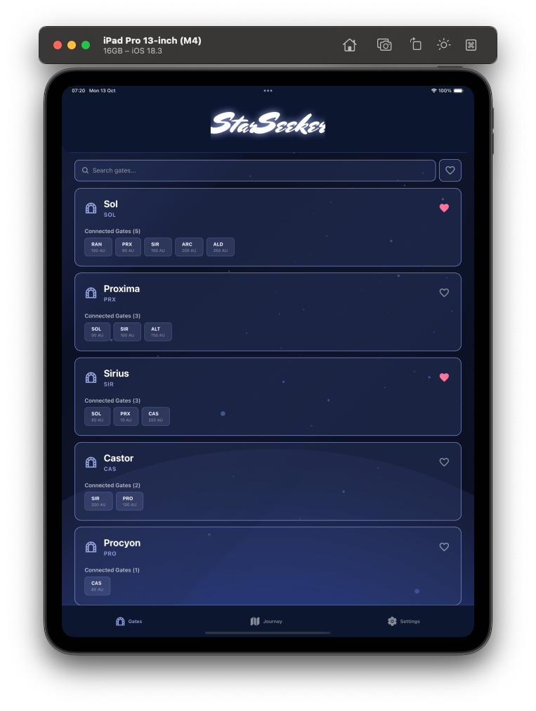

# StarSeeker ✨

A mobile app for tracking and managing gate information, built with Expo and React Native.

## Quick Start - Try it Now!

Scan the QR code below with the Expo Go app to try StarSeeker instantly:

<div align="center">
  
</div>

### Installation Steps

1. **Install Expo Go** on your device:
   - [iOS App Store](https://apps.apple.com/app/expo-go/id982107779)
   - [Android Play Store](https://play.google.com/store/apps/details?id=host.exp.exponent)

2. **Scan the QR code** above with:
   - iOS: Use your Camera app
   - Android: Use the Expo Go app's built-in scanner

3. **Start exploring!** The app will load automatically.

## Screenshots

<div align="center">
  
  
  
</div>

<div align="center">
  
  
</div>

## Development Setup

### Prerequisites

- Node.js (v18 or newer)
- npm or yarn
- Expo Go app (for testing)

### Local Development

1. **Clone and install dependencies**

   ```bash
   git clone <repository-url>
   cd StarSeeker
   npm install
   ```

2. **Start the development server**

   ```bash
   npx expo start
   ```

3. **Run on your device**
   - Scan the QR code with Expo Go
   - Press `i` for iOS simulator
   - Press `a` for Android emulator

## Building for Production

This project uses EAS (Expo Application Services) for building production apps.

### Build Profiles

```bash
# Development build with debugging tools
eas build --profile development

# Preview build for testing
eas build --profile preview

# Android APK for direct distribution
eas build --profile preview-apk --platform android

# Production build for app stores
eas build --profile production
```

### Publishing Updates

Share updates with your team without rebuilding:

```bash
# Publish to preview channel
eas update --channel preview --message "Latest changes"

# Publish to production
eas update --channel production --message "v1.0.1 release"
```

## Tech Stack

- **Framework**: Expo SDK 54
- **Navigation**: Expo Router (file-based routing)
- **Language**: TypeScript
- **UI**: React Native
- **Features**: Audio support, custom fonts, splash screens

## Project Structure

```
StarSeeker/
├── app/              # File-based routing (screens)
├── components/       # Reusable components
├── services/         # API and cache services
├── types/           # TypeScript type definitions
├── assets/          # Images, fonts, icons
└── screenshots/     # App screenshots
```

## Learn More

- [Expo Documentation](https://docs.expo.dev/)
- [Expo Router](https://docs.expo.dev/router/introduction/)
- [EAS Build](https://docs.expo.dev/build/introduction/)
- [EAS Update](https://docs.expo.dev/eas-update/introduction/)
